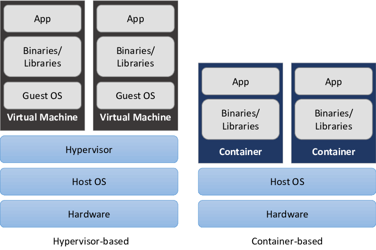

# Data Engineer at Banco Carrefour Bootcamp

    

This repository contains the projects, files, and notes generated across the Bootcamp.

- **[Bootcamp checklist | Notion](https://www.notion.so/Banco-Carrefour-Data-Enginner-5ee277a06ae848b49073aea98753946d)**

## Git & GitHub course

The first content I saw was the Git & GitHub course, because I wanted to reinforce some concepts and  certainly see new stuff.

SHA1 - Secure Hash Algorithm | Used to identify a commit

Commit - store tree, parent, author, message and timestamp. Makes a hash of it.

- [Git Cheat Sheet from **GitHub** Training](https://training.github.com/downloads/github-git-cheat-sheet.pdf) | Cheat Sheets are always a resource that I search for learning something. This one from **GitHub** Training is very cute.

 

## Introduction to Data Engineer

1. What is a Pipeline?
2. Difference between data professionals 
3. DataOPS

## Introduction to Data Science

## Introduction to Container Orchestration with Docker

I had already used Databases in Docker Containers and I wanted to learn more and organize my knowledge. In this course I learned about creating images, containers.

- [**Docker Cheat Sheet**](https://www.docker.com/sites/default/files/d8/2019-09/docker-cheat-sheet.pdf)

1. Introduction to the theme

   - Virtual Machines and Containers

     

   

   

   - Docker architecture

     

2. First steps with Docker

3. Docker network

   - Bridge: is the default docker network, used for communication between containers.

     <code>

     $ docker network ls

     $ docker network create -d bridge petsBridge

     $ docker run -d --net petsBridge --name db consul

     $ docker run -d --env "DB=db" --net petsBridge --name web -p 8000:5000 chrch/docker-pets:1.0

     $ docker exec -it web sh

     ​		$ hostname

     </code>

   - Host: removes network isolation, the container responds directly to the host's network card.

     <code>

     $ docker run -d --net host --name db consul

     $ docker run -d --env "DB=localhost" --net host chrch/docker-pets:1.0

     $ docker ps

     $ netstat -nltp

     $ docker logs web

     </code>

   - Overlay: allows communication between containers from different hosts.

     <code>

     $ docker ps

     $ docker rm -f CONTAINER-ID

     $ docker ps -a

     $ docker network create -d bridge petsBridge

     $ docker restart 7c

     <!-- para fazer a comunicação de containers em servidores diferentes, precisamos criar nosso cluster. No nosso caso é um cluster de swarm, mas veremos kubernets tbm. -->

     $ docker swarm init --advertise-addr 192.168.0.18

     $ docker network create -d overlay petsOverlay

     $ docker network ls

     $ docker ps -a

     $ docker service ls

     $ docker service scale web=3

     $ docker service converged

     $ docker swarm join...

     $ docker service scale <service_name>=<int>

     $ docker service create...

     </code>

   - Macvlan: allows you to assign a MAC address to the container, making it visible as a physical container.

   - No network 

     

4. Docker storage

   - storage types:

     

   - on practice

     <code>

     $ docker volume create myFirstVolume

     $ docker volume ls

     $ docker volume inspect myFirstVolume

     $ docker run -d -p 80:80 --name container-volume --mount source=myFirstVolume, target=/usr/share/nginx nginx

     $ vim index.html

     </code>

5. Our project on air

